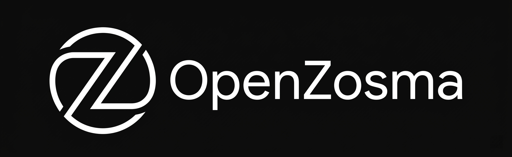

<div align="center">



<h3>Build AI teams that work alongside yours -- accessible from your phone.</h3>

<p>
Open-source, self-hosted platform for hierarchical AI agents.<br />
Delegate tasks through natural conversation from WhatsApp, Slack, or a web dashboard.
</p>

<p>
  <a href="https://github.com/zosmaai/openzosma/blob/main/LICENSE"></a>
  <a href="https://github.com/zosmaai/openzosma/actions/workflows/ci.yml"></a>
  <a href="https://www.npmjs.com/package/create-openzosma"></a>
  = 22" />
  
</p>

<p>
  <a href="https://github.com/zosmaai/openzosma/stargazers"></a>
  <a href="https://github.com/zosmaai/openzosma/graphs/contributors"></a>
  <a href="https://github.com/zosmaai/openzosma/issues"></a>
  <a href="https://github.com/zosmaai/openzosma/pulls"></a>
</p>

<p>
  <a href="#get-started">Get Started</a> &middot;
  <a href="#how-it-works">How It Works</a> &middot;
  <a href="#architecture">Architecture</a> &middot;
  <a href="./ARCHITECTURE.md">Full Design Doc</a> &middot;
  <a href="./CONTRIBUTING.md">Contributing</a>
</p>

</div>

---

## ⚡ Looking for a Standalone Agent Harness?

If you want a **lightweight, deployable agent server** without the full platform (no PostgreSQL, no dashboard, no auth complexity), check out **[@openzosma/pi-harness](./packages/pi-harness)**:

```bash
npm install -g @openzosma/pi-harness
pi-harness   # First run auto-configures, then starts the server
```

It runs `pi-coding-agent` headlessly as a background HTTP/SSE server — perfect for low-end hardware, background services, custom integrations, or when you just want the agent without the platform. [Learn more →](./packages/pi-harness)

---

## Get Started

One command sets up everything -- cloning, environment, Docker services, database migrations, and the first build:

```bash
pnpm create openzosma
```

or

```bash
npx create-openzosma
```

The CLI walks you through choosing an LLM provider, configuring PostgreSQL, setting up auth secrets, and optionally enabling sandboxed execution. At the end it offers to start the gateway and dashboard for you.

**Already cloned?** Run `pnpm setup` from the repo root instead. The CLI detects the existing checkout and skips the clone step.

### Requirements

- **Node.js** >= 22
- **pnpm** (latest)
- **Docker** and **Docker Compose**
- **Git**
- **OpenShell CLI** (optional -- only needed for sandbox mode)

<details>
<summary><strong>Manual setup (without the CLI)</strong></summary>

```bash
git clone https://github.com/zosmaai/openzosma.git
cd openzosma
pnpm install

# Start services: PostgreSQL (with pgvector), Valkey, and RabbitMQ
docker compose up -d

# Configure environment
cp .env.example .env.local
# Edit .env.local -- at minimum set an LLM API key and AUTH_SECRET

# Build all packages (required before migrations)
pnpm run build

# Run database migrations
pnpm db:migrate
pnpm db:migrate:auth

# Start the gateway and dashboard
pnpm --filter @openzosma/gateway dev   # Terminal 1 (port 4000)
pnpm --filter @openzosma/web dev       # Terminal 2 (port 3000)
```

Open <http://localhost:3000>, sign up, and start a conversation.

> **Note:** The gateway `dev` script loads `../../.env.local` automatically via `--env-file`. If you need a different env file, run `npx tsx --env-file=<path> src/index.ts` from `packages/gateway/`.

</details>

---

## What is OpenZosma?

OpenZosma is an open-source, self-hosted platform for creating hierarchical AI agents that act as digital work twins for your team. Configure an agent org chart that mirrors your business structure, delegate tasks through natural conversation, and manage your operations from anywhere -- your phone, WhatsApp, Slack, or a web dashboard. No laptop required.

Agents don't replace your team. They handle the routine lookups, status checks, data entry, and coordination that eat up your team's day -- so your people can focus on work that requires human judgment.

<div align="center">
  <h3>Watch: Set up OpenZosma in under 2 minutes</h3>
  
</div>

### Key Features

- **Hierarchical agents** -- Configure org-chart-like agent trees. Manager agents delegate to specialist agents automatically.
- **Talk from anywhere** -- Web dashboard, mobile app, WhatsApp, Slack, or agent-to-agent via the [A2A protocol](https://github.com/google/A2A).
- **Self-hosted** -- Your data stays on your infrastructure. One instance = one organization.
- **Connect your tools** -- Integrate with databases, CRMs, email, and other business systems through configurable connectors.
- **Secure by design** -- Each agent session runs in an isolated sandbox ([NVIDIA NemoClaw](https://github.com/NVIDIA/NemoClaw) + [OpenShell](https://github.com/NVIDIA/OpenShell)) with Landlock, seccomp, and network namespace isolation.
- **Open source** -- Apache 2.0 license. No vendor lock-in, no usage fees, no data leaving your network.

---

## How It Works

You define a hierarchy of agents that mirrors your organization. Each agent has a role, a set of capabilities, and knows which agents report to it. You talk to the top-level agent, and it delegates work down the chain.

<div align="center">
  
</div>

**Example:** You message your CEO Agent from WhatsApp: _"What were last week's sales numbers and are there any open support tickets over 48 hours?"_ The CEO Agent delegates to the Sales Manager Agent and Support Agent in parallel. They query your connected systems, and you get a consolidated answer back -- all from a single message on your phone.

---

## Architecture

<div align="center">
  
</div>

The gateway runs in two modes controlled by `OPENZOSMA_SANDBOX_MODE`:

| Mode                  | How it works                                                                                                                 | Best for    |
| --------------------- | ---------------------------------------------------------------------------------------------------------------------------- | ----------- |
| **`local`** (default) | pi-agent runs in-process inside the gateway. No OpenShell needed.                                                            | Development |
| **`orchestrator`**    | Each user gets a persistent OpenShell sandbox. The orchestrator manages sandbox lifecycle and proxies messages via HTTP/SSE. | Production  |

> **Want just the agent, without the gateway?** [`pi-harness`](./packages/pi-harness) is the local mode extracted as a standalone, deployable package — no PostgreSQL, no dashboard, no auth complexity. One `npm install -g` and you're running.

See [ARCHITECTURE.md](./ARCHITECTURE.md) for the full system design, data flow, and component details.

<details>
<summary><strong>Running with sandboxes (orchestrator mode)</strong></summary>

```bash
# 1. Install the OpenShell CLI and start the gateway (bootstraps a local K3s cluster)
#    https://github.com/NVIDIA/OpenShell
openshell gateway start

# 2. Build the sandbox image and import it into the K3s cluster
./scripts/build-sandbox.sh v0.1.0

# 3. Set sandbox mode in .env.local
OPENZOSMA_SANDBOX_MODE=orchestrator
SANDBOX_IMAGE=openzosma/sandbox-server:v0.1.0

# 4. Start the gateway (it will create sandboxes on demand)
pnpm --filter @openzosma/gateway dev
```

Use a versioned tag (e.g. `v0.1.0`), not `:latest`. K3s sets `imagePullPolicy: Always` for `:latest`, which causes `ImagePullBackOff` since the image is local, not on Docker Hub.

See [infra/openshell/README.md](./infra/openshell/README.md) for sandbox image details and policy configuration.

</details>

---

## Tech Stack

| Component       | Technology                                                 |
| --------------- | ---------------------------------------------------------- |
| Runtime         | Node.js 22 (TypeScript)                                    |
| HTTP Server     | Hono                                                       |
| Database        | PostgreSQL (raw SQL via `pg`, migrations via `db-migrate`) |
| Auth            | Better Auth                                                |
| Sandbox         | NVIDIA NemoClaw + OpenShell                                |
| Web Dashboard   | Next.js 16, React 19, Tailwind CSS v4                      |
| Mobile          | React Native (planned)                                     |
| Agent Protocol  | [Google A2A](https://github.com/google/A2A)                |
| Cache / Pub-Sub | Valkey (ioredis)                                           |
| Internal Comms  | HTTP / SSE (orchestrator to sandbox-server)                |

---

## Supported LLM Providers

| Provider    | Default model                                       |
| ----------- | --------------------------------------------------- |
| Anthropic   | Claude Sonnet 4                                     |
| OpenAI      | GPT-4o                                              |
| Google      | Gemini 2.5 Flash                                    |
| Groq        | Llama 3.3 70B                                       |
| xAI         | Grok 3                                              |
| Mistral     | Mistral Large                                       |
| Local model | Any OpenAI-compatible endpoint (Ollama, vLLM, etc.) |

---

## Project Structure

```
openzosma/
  apps/
    web/                  Next.js dashboard
    mobile/               React Native app (planned)
  packages/
    gateway/              API gateway (REST + WebSocket + A2A)
    orchestrator/         Sandbox lifecycle, session proxying, health checks
    agents/               Agent provider interface + implementations
    pi-harness/           Standalone headless agent server (lightweight deploy)
    sandbox/              OpenShell CLI wrapper
    sandbox-server/       HTTP server running inside sandbox containers
    db/                   Database migrations and query module
    auth/                 Better Auth setup
    a2a/                  A2A protocol implementation
    grpc/                 Proto definitions + generated stubs
    sdk/                  Client SDK (@openzosma/sdk)
    adapters/             Channel adapters (Slack, WhatsApp)
    skills/               Enterprise skills (reports, charts)
  proto/                  Protobuf service definitions
  infra/
    openshell/            Sandbox Dockerfile, policies, entrypoint
  docs/                   Phase implementation plans
```

---

## Roadmap

| Phase                                     | Description                                                         | Status            |
| ----------------------------------------- | ------------------------------------------------------------------- | ----------------- |
| [Phase 1](./docs/PHASE-1-MULTITENANT.md)  | Multi-instance pi-agent refactor (in pi-mono)                       | Complete          |
| [Phase 2](./docs/PHASE-2-MONOREPO.md)     | Monorepo setup + DB schema + auth                                   | Complete          |
| [Phase 3](./docs/PHASE-3-GATEWAY.md)      | API Gateway + A2A + auth                                            | Complete          |
| **Pi-Harness**                            | Standalone headless agent server ([package](./packages/pi-harness)) | Complete          |
| [Phase 4](./docs/PHASE-4-ORCHESTRATOR.md) | Orchestrator + OpenShell sandbox integration                        | In progress       |
| [Phase 5](./docs/PHASE-5-ADAPTERS.md)     | Channel adapters (Slack, WhatsApp)                                  | Not started       |
| [Phase 6](./docs/PHASE-6-SKILLS.md)       | Enterprise skills (database tool, reports)                          | Not started       |
| [Phase 7](./docs/PHASE-7-DASHBOARD.md)    | Web dashboard                                                       | In progress (MVP) |

**MVP (Phases 1-4):** ~4 weeks &nbsp;|&nbsp; **Full platform (Phases 1-7):** ~10 weeks

---

## Documentation

| Document                                                         | Description                                           |
| ---------------------------------------------------------------- | ----------------------------------------------------- |
| [ARCHITECTURE.md](./ARCHITECTURE.md)                             | System design, component interactions, data flow      |
| [CONTRIBUTING.md](./CONTRIBUTING.md)                             | Development setup, environment variables, conventions |
| [packages/db/README.md](./packages/db/README.md)                 | Database migrations, schemas, query module            |
| [packages/pi-harness/README.md](./packages/pi-harness/README.md) | Standalone headless agent server docs                 |
| [docs/](./docs/)                                                 | Phase-by-phase implementation plans                   |

---

## Related Projects

- **[pi-mono](https://github.com/badlogic/pi-mono)** -- Agent SDK (`pi-ai`, `pi-agent-core`, `pi-coding-agent`)
- **[NVIDIA NemoClaw](https://github.com/NVIDIA/NemoClaw)** -- Sandbox runtime with Landlock + seccomp isolation
- **[NVIDIA OpenShell](https://github.com/NVIDIA/OpenShell)** -- K3s-based sandbox infrastructure
- **[Google A2A](https://github.com/google/A2A)** -- Agent-to-Agent protocol (JSON-RPC 2.0)

---

## Contributors

<a href="https://github.com/zosmaai/openzosma/graphs/contributors">
  
</a>

## Star History

[](https://star-history.com/#zosmaai/openzosma&Date)

## License

[Apache License 2.0](./LICENSE)
